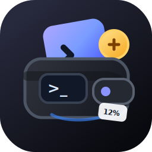

# Toki

<p align="center">
  
</p>

<p align="center">
  <strong>A tiny macOS menu bar companion for AI coding agents and usage.</strong>
</p>

<p align="center">
  
  
  
  
  
  <a href="https://github.com/aashutoshrathi/toki"></a>
</p>

<p align="center">
  <code>/toki</code> keeps your active AI coding accounts, current-session quota, and weekly quota one click away.
</p>

<table>
  <tr><th style="width:50%">Menu bar</th><th style="width:50%">CLI</th></tr>
  <tr>
    <td></td>
    <td><pre>            @@@@ @@@@             <br>   @@@@@@@@@@@     @@@@@@@        <br>   @@@@@@@@@@@     @@@@@@@        <br>            @@@@@@@@@             <br>              @@@@@               <br>               @@@                  /toki<br>               @@@    @@@           v2.4.1<br>               @@@   @@@@           github.com/aashutoshrathi/toki<br>               @@@@@@@@@          <br>               @@@@@@@            <br>               @@@@@              <br>               @@@@               <br>               @@@@@              <br>                @@@@@@@@@@        <br><br>Claude San: 85% left<br>Codex: 0% left<br>OpenCode: No usage today<br>Pi: $0.01 today</pre></td>
  </tr>
</table>


## Why Toki

Toki is built for people who jump between Claude Code, Codex, Copilot, Gemini, Grok, OpenCode, and Pi during the day and want a fast, local view of usage and active agents.

It works especially well with [`claude-swap`](https://github.com/realiti4/claude-swap): Toki discovers the same Claude Code account registry, shows active and inactive accounts, and lets you switch accounts without reimplementing credential-management logic.

Toki stays local. Credentials are read from your Mac, your configured commands, or provider auth files. The app does not run a cloud service.

## Install

### Homebrew

```sh
brew tap aashutoshrathi/tap
brew trust --cask aashutoshrathi/tap/toki
brew install --cask toki
```

The cask installs the latest release DMG. Toki is ad-hoc signed and not notarized, so on first launch macOS may block it - right-click Toki in Applications and choose Open, or run `xattr -dr com.apple.quarantine /Applications/Toki.app`.

### Direct download

Grab the latest `Toki_<version>_universal.dmg` from the [releases page](https://github.com/aashutoshrathi/toki/releases/latest), open it, and drag Toki to Applications. Updates install in-app once running.

## Install From Source

Build and run:

```sh
swift run Toki
```

Build and install an app bundle:

```sh
scripts/install-app.sh
open ~/Applications/Toki.app
```

Build the app bundle without installing:

```sh
scripts/build-app.sh
open .build/Toki.app
```

The generated app bundle is written to `.build/Toki.app`.

## Requirements

- macOS 14 or newer.
- Swift 6 toolchain.
- Claude Code installed and authenticated.
- `claude-swap` installed and configured for multi-account Claude workflows.
- Codex installed and authenticated for Codex usage.
- Pi installed with local session history when using Pi usage and active-agent tracking.
- Copilot CLI, Gemini CLI, Grok CLI, or OpenCode installed when using active-agent discovery for those tools.

macOS may ask for Keychain access the first time Toki reads Claude Code or `claude-swap` credentials.

## Features

- Live quota and rate-limit tracking for Claude Code (multi-account via `claude-swap`, with discovery, one-click switching, and Keychain credential lookup) and Codex, plus local token and spend tracking for OpenCode and Pi. Pi usage comes from local session history and shows tokens plus estimated costs.
- One-click redemption of banked Codex rate-limit reset credits, gated to when the current window is mostly used.
- Active-agent discovery across Codex, Claude Code, Copilot CLI, Gemini CLI, Grok CLI, OpenCode, Pi, and ChatGPT-hosted Codex, with best-effort navigation to the matching terminal tab or host app. Each agent card shows per-session cost and token usage when available (OpenCode, Pi, and Claude Code).
- Agents waiting on you are called out with a red dot and the question they asked, on the card, the Agents tab, and the menu bar - so a session blocked on a prompt is visible without going looking for it. Supported for Claude Code and OpenCode.
- Daily usage heatmap over the last 30 days, filterable by provider, covering Claude Code, OpenCode, and Pi. Activity is read from each tool's own session history, so it reflects work done before Toki was ever installed.
- Experimental "live in the notch" mode (off by default, notched Macs only) puts the readout at the display notch instead of the menu bar, in one of three resting positions, expanding on hover.
- AI-powered insight card with on-device Apple Intelligence summarization (macOS 26+), falling back to a deterministic recommendation with one-click smart switch. Custom instructions get their own Settings page and take priority over the default tone/format.
- Native low-quota and session-warning notifications with cooldowns, DND mode, and local event/usage history.
- Session mode for tracking quota burn during a focused coding run.
- `Toki status` CLI for scripting and shell prompts, plus a Launch at Login toggle backed by `SMAppService`.
- Configurable menu bar display modes, inline account aliases, automatic connection of any detected provider the moment it's signed in (no manual step), and optional manual ledgers for plans without a usage API.
- One-click, verified app updates and privacy-safe rotating diagnostics.

## Configuration

Toki connects providers automatically. Every time the popover opens, it scans for Claude Code (Keychain), Codex (`~/.codex/auth.json`), OpenCode (its local database), Pi (local JSONL session history), Grok CLI (`~/.grok/auth.json`), and Gemini CLI (`~/.gemini/oauth_creds.json`). Config-backed providers get written to `~/.toki/config.json`; local-only OpenCode and Pi accounts are detected fresh each time. There's no Connect button or JSON to hand-write, and it re-scans on every open, so signing into a new provider later is picked up automatically. Until an account exists, the popover shows a **Connect an account** screen while it scans.

For scripting, multi-account setups, or fields the wizard doesn't cover (API keys, budgets, manual trackers), edit the config directly. Toki reads:

```text
~/.toki/config.json
```

Create a starting config:

```sh
mkdir -p ~/.toki
cp examples/config.example.json ~/.toki/config.json
```

Minimal Claude Code plus Codex config:

```json
{
  "refreshMinutes": 5,
  "accountLabels": [
    {
      "email": "work@example.com",
      "organizationUuid": "00000000-0000-0000-0000-000000000000",
      "nickname": "Work",
      "color": "#4F8EF7"
    },
    {
      "email": "personal@example.com",
      "nickname": "Personal",
      "color": "#F59E0B"
    }
  ],
  "accounts": [
    {
      "label": "Claude",
      "type": "claudeCode",
      "claudeSwapCommand": "claude-swap"
    },
    {
      "label": "Codex",
      "type": "codex",
      "codexAuthPath": "~/.codex/auth.json"
    }
  ]
}
```

Each account needs a `label` (display name) and a `type` (provider). An `id` is optional and derived from the label when omitted. Older configs using `name`/`provider`/`id` are migrated automatically on launch, keeping a `.bak` of the original.

`accountLabels` are optional presentation overrides. Toki matches discovered Claude accounts by email and, when provided, organization UUID or name. Labels do not alter credentials or switching behavior.

`refreshMinutes` defaults to `5`. API-backed providers refresh stale-while-revalidate style: Toki keeps the last visible usage while refreshing in the background. Automatic refreshes pace Claude Code API calls at 7.5 minutes to reduce early `429` responses, while Codex uses the 5-minute cadence. Opening the popover or pressing reload can refresh sooner, but still keeps a 1-minute minimum between provider API calls. If a provider returns `429`, Toki keeps showing the last good usage snapshot.

`aiInstructions` is an optional string that customizes the on-device LLM prompt used by the AIInsightCard on macOS 26+. When absent, Toki uses a default prompt based on the current recommendation and account snapshots.
### Smart Recommendations, AI Insights, Notifications, and History

Toki keeps v2.1 preferences, notification cooldowns, event history, usage history, and session state in:

```text
~/.toki/usage-state.json
```

The overview shows a single AIInsightCard in place of the old Use/Status/Session blocks. On macOS 26+ with Apple Intelligence available, it generates a natural-language summary with actionable suggestions, marked by a purple sparkle icon and border; steer its prompt with the optional `aiInstructions` config field. On older systems it shows the same deterministic recommendation with a lightbulb icon.

The settings panel controls native notifications, DND mode, low-quota threshold, session warning threshold, notification cooldown, history retention, and the menu bar display mode. DND suppresses delivery but still records events so you can audit what would have fired.

The Agents tab inspects the local process table without persisting command lines, prompts, workspace names, or session titles. Each agent shows its conversation title when available (including Pi's local session title), otherwise the project folder name (`~/Code/project`). OpenCode, Pi, and Claude Code agents also display the session's running cost and token counts directly on their card. Clicking an agent with a terminal TTY selects its tab in iTerm2 or Terminal; other hosts (VS Code, Cursor, ChatGPT) are activated via bundle ID.

OpenCode and Pi are auto-detected from local storage and surfaced as accounts (Pi stays one aggregated card even across different underlying model providers). Copilot, Gemini, and Grok are agent-detection-only: Toki shows a local active-session count (and, for Gemini/Grok, sign-in state) but invents no quota, since none of GitHub, Google, or xAI expose a usage API for them.

### Updates and Diagnostics

Toki checks the latest public GitHub release at most once every six hours, including while open; Settings has a manual “Check now” that bypasses the schedule. A newer release shows an Update button that downloads its DMG, verifies the `local.toki` bundle identity, version, and code signature, stages the app, and replaces the installed bundle after Toki exits, then relaunches. Set `TOKI_MOCK_UPDATE_VERSION=9.9.9` when developing to preview the banner without a release.

Toki writes rotating diagnostics to `~/.toki/logs/toki.log`, containing app-level error categories and status codes only - no credentials, config, prompts, session titles, workspace names, or full file paths. “Send debug report” creates a local text attachment and opens the macOS share picker; Toki never sends it automatically.

Session mode records starting quota for visible accounts, then shows a red banner with a live stopwatch and per-account burn during the run, logging warning events when quota drops sharply or crosses the configured threshold. Its play/stop toggle sits in the header next to refresh.

### Launch at Login

Settings has a "Launch at login" toggle backed by `SMAppService`. It reflects whatever System Settings > General > Login Items actually says rather than a separate stored preference, so removing Toki there also turns the toggle off. macOS occasionally requires approving a freshly-added login item in that same pane before it takes effect - when that happens, the toggle shows an inline "Needs approval" note with a shortcut straight there.

### Command Line Status

```sh
toki status                    # one line per account, e.g. "Work: 82% left" (configured name, not provider name)
toki status pi                 # filter to a provider (pi, codex, claude, ...) or account name
toki status --compact          # single line matching the menu bar icon, for prompts/status bars
toki status --json             # full snapshot as JSON
toki status --watch            # redraw live every 5s (--watch=N for other intervals); Ctrl-C to stop
toki status codex --exit-code  # exit 2 when the matching tracked quota is exhausted, for scripts
toki status --help             # full option list

toki pi                        # Pi spend breakdown: today / this week / this month / all time (--json too)
```

Run `toki status` or `toki pi` from your terminal. Toki automatically symlinks itself to `/usr/local/bin/toki` on launch so it's on your PATH without any setup. `status` reads a cache the running app writes after every refresh at `~/.toki/status.json` (override with `TOKI_STATUS_CACHE`) - it never launches the menu bar app or makes a live network/Keychain call, so it's safe to call on every shell prompt render. If Toki hasn't run yet, or the cache is more than 15 minutes old, it says so on stderr. `pi` is independent of the cache: it computes the breakdown directly from local Pi session history, so it works even when the app has never run.

### Environment Overrides

```sh
TOKI_CONFIG=/path/to/config.json swift run Toki
TOKI_STATE=/path/to/usage-state.json swift run Toki
TOKI_STATUS_CACHE=/path/to/status.json swift run Toki
```

Legacy TokenBar paths and variables are still recognized during the rename:

- `TOKENBAR_CONFIG`
- `TOKENBAR_STATE`
- `~/.tokenbar/config.json`
- `~/.tokenbar/usage-state.json`

## Account Switching

When an inactive Claude Code account is switched, Toki runs:

```sh
claude-swap --switch-to <slot>
```

After the command succeeds, Toki reloads account discovery and refreshes usage. If `claude-swap` is not on your `PATH`, set `claudeSwapCommand` to the full executable path.

## Codex Usage

Add a Codex account when this Mac is signed in to Codex:

```json
{
  "label": "Codex",
  "type": "codex",
  "codexAuthPath": "~/.codex/auth.json"
}
```

Toki reads `~/.codex/auth.json` by default and asks the local Codex app-server for account usage and rate limits. Set `codexAuthPath` to use a different auth file.

Codex usage is separate from OpenAI organization API usage.

When OpenAI has a banked rate-limit reset credit for the account, the expanded Codex card shows a **Reset now** button (with the count when more than one is banked). It stays disabled until the current window is at least 80% used, so a reset isn't spent while there's still plenty of quota left - redeeming one resets the rate-limit window immediately via the Codex app-server.

## Pi Usage

Pi needs no Toki account configuration. Toki reads only the local JSONL session metadata it needs for usage and active-agent display - assistant token counts, Pi's estimated costs, session working directories, timestamps, and titles - never Pi auth data or prompt/message content. The card shows today's spend plus this-week, this-month, and all-time estimated totals, combining every underlying provider into one harness card.

Toki discovers the session root in this order:

1. `PI_CODING_AGENT_SESSION_DIR`.
2. `sessionDir` in the global `~/.pi/agent/settings.json` (or the corresponding settings file under `PI_CODING_AGENT_DIR`).
3. `${PI_CODING_AGENT_DIR}/sessions` (normally `~/.pi/agent/sessions`).

Override paths must be absolute, exactly `~`, or begin with `~/`. Relative paths in `PI_CODING_AGENT_SESSION_DIR`, `PI_CODING_AGENT_DIR`, or the global `settings.json` cannot be auto-resolved. Project-local `.pi/settings.json` `sessionDir` values are not globally discoverable, nor are per-invocation `--session-dir` values, so sessions stored only through either mechanism are not tracked.

## Development

Common commands:

```sh
swift build
swift run Toki
scripts/build-app.sh
```

Before shipping a local change, run:

```sh
swift build
scripts/build-app.sh
plutil -p .build/Toki.app/Contents/Info.plist
```

`swift-format` is not vendored in this repository. Keep Swift changes compiler-clean, locally scoped, and consistent with existing SwiftUI/AppKit conventions.

## Repository

```text
aashutoshrathi/toki
```

Toki keeps backwards-compatible config fallbacks for the old TokenBar name, but new docs, app bundles, examples, and package metadata use Toki.

## Troubleshooting

- `Config needed`: create `~/.toki/config.json` or set `TOKI_CONFIG`.
- `No credentials found`: confirm Claude Code and `claude-swap` are authenticated and that Keychain access was allowed.
- `Claude Code usage unavailable`: Anthropic did not return usage data for that account. Try refreshing later or check the account in Claude Code.
- `Codex usage unavailable`: confirm `codex login` has created `~/.codex/auth.json`, then refresh Toki.
- Pi does not appear: confirm its session directory contains JSONL history and that any global environment/settings override is absolute, exactly `~`, or begins with `~/`. Per-invocation `--session-dir` sessions are not auto-discovered.
- Switch fails: run `claude-swap --switch-to <slot>` in Terminal to inspect the underlying error.
- Notifications do not appear: open the Events tab to check whether DND or cooldowns suppressed delivery, then confirm macOS notification permission for Toki.

## License

Toki is free software: you can redistribute it and/or modify it under the terms of the GNU General Public License as published by the Free Software Foundation, either version 3 of the License, or (at your option) any later version.

Toki is distributed in the hope that it will be useful, but WITHOUT ANY WARRANTY; without even the implied warranty of MERCHANTABILITY or FITNESS FOR A PARTICULAR PURPOSE. See the GNU General Public License for more details.

You should have received a copy of the GNU General Public License along with Toki. If not, see <https://www.gnu.org/licenses/>.
