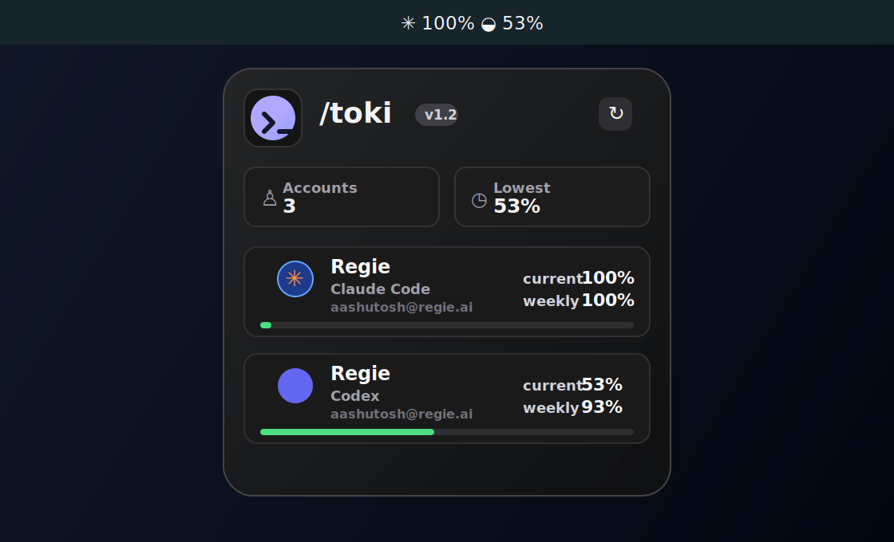

# Toki

<p align="center">
  
</p>

<p align="center">
  <strong>A tiny macOS menu bar balance sheet for Claude Code and Codex usage.</strong>
</p>

<p align="center">
  
  
  
</p>

<p align="center">
  <code>/toki</code> keeps your active AI coding accounts, current-session quota, and weekly quota one click away.
</p>

<p align="center">
  
</p>

## Why Toki

Toki is built for people who jump between Claude Code and Codex during the day and want a fast, local answer to: "how much coding fuel do I have left?"

It works especially well with [`claude-swap`](https://github.com/realiti4/claude-swap): Toki discovers the same Claude Code account registry, shows active and inactive accounts, and lets you switch accounts without reimplementing credential-management logic.

Toki stays local. Credentials are read from your Mac, your configured commands, or provider auth files. The app does not run a cloud service.

## Features

- Native macOS menu bar app with a compact popover and right-aligned header controls.
- Claude Code account discovery from `~/.claude-swap-backup/sequence.json`.
- Active Claude Code credential lookup from macOS Keychain service `Claude Code-credentials`.
- Inactive Claude account lookup from macOS Keychain service `claude-swap`.
- Claude Code 5-hour and 7-day utilization, reset timing, and spend data when available.
- Codex usage and rate-limit display through the local Codex app-server.
- Inline account aliases so long emails can become readable names.
- Switch button for inactive Claude Code accounts via `claude-swap --switch-to`.
- Optional manual ledgers for consumer plans where exact provider APIs are not available.
- Bundled `/toki` wallet logo and Codex SVG account mark.

## Requirements

- macOS 14 or newer.
- Swift 6 toolchain.
- Claude Code installed and authenticated.
- `claude-swap` installed and configured for multi-account Claude workflows.
- Codex installed and authenticated for Codex usage.

macOS may ask for Keychain access the first time Toki reads Claude Code or `claude-swap` credentials.

## Install From Source

Build and run:

```sh
swift run Toki
```

Build and install an app bundle:

```sh
scripts/install-app.sh
open ~/Applications/Toki.app
```

Build the app bundle without installing:

```sh
scripts/build-app.sh
open .build/Toki.app
```

The generated app bundle is written to `.build/Toki.app`.

## Configuration

Toki reads:

```text
~/.toki/config.json
```

Create a starting config:

```sh
mkdir -p ~/.toki
cp examples/config.example.json ~/.toki/config.json
```

Minimal Claude Code plus Codex config:

```json
{
  "refreshMinutes": 5,
  "accountLabels": [
    {
      "email": "work@example.com",
      "organizationUuid": "00000000-0000-0000-0000-000000000000",
      "nickname": "Work",
      "color": "#4F8EF7"
    },
    {
      "email": "personal@example.com",
      "nickname": "Personal",
      "color": "#F59E0B"
    }
  ],
  "accounts": [
    {
      "id": "claude-code",
      "name": "Claude",
      "provider": "claudeCode",
      "claudeSwapCommand": "claude-swap"
    },
    {
      "id": "codex",
      "name": "Codex",
      "provider": "codex",
      "codexAuthPath": "~/.codex/auth.json"
    }
  ]
}
```

`accountLabels` are optional presentation overrides. Toki matches discovered Claude accounts by email and, when provided, organization UUID or name. Labels do not alter credentials or switching behavior.

`refreshMinutes` defaults to `5`. API-backed providers refresh stale-while-revalidate style: Toki keeps the last visible usage while refreshing in the background. Automatic refreshes pace Claude Code API calls at 7.5 minutes to reduce early `429` responses, while Codex uses the 5-minute cadence. Opening the popover or pressing reload can refresh sooner, but still keeps a 1-minute minimum between provider API calls. If a provider returns `429`, Toki keeps showing the last good usage snapshot.

### Environment Overrides

```sh
TOKI_CONFIG=/path/to/config.json swift run Toki
TOKI_STATE=/path/to/usage-state.json swift run Toki
```

Legacy TokenBar paths and variables are still recognized during the rename:

- `TOKENBAR_CONFIG`
- `TOKENBAR_STATE`
- `~/.tokenbar/config.json`
- `~/.tokenbar/usage-state.json`

## Account Switching

When an inactive Claude Code account is switched, Toki runs:

```sh
claude-swap --switch-to <slot>
```

After the command succeeds, Toki reloads account discovery and refreshes usage. If `claude-swap` is not on your `PATH`, set `claudeSwapCommand` to the full executable path.

## Codex Usage

Add a Codex account when this Mac is signed in to Codex:

```json
{
  "id": "codex",
  "name": "Codex",
  "provider": "codex"
}
```

Toki reads `~/.codex/auth.json` by default and asks the local Codex app-server for account usage and rate limits. Set `codexAuthPath` to use a different auth file.

Codex usage is separate from OpenAI organization API usage.

## Development

Common commands:

```sh
swift build
swift run Toki
scripts/build-app.sh
```

Before shipping a local change, run:

```sh
swift build
scripts/build-app.sh
plutil -p .build/Toki.app/Contents/Info.plist
```

`swift-format` is not vendored in this repository. Keep Swift changes compiler-clean, locally scoped, and consistent with existing SwiftUI/AppKit conventions.

## Repository

```text
aashutoshrathi/toki
```

Toki keeps backwards-compatible config fallbacks for the old TokenBar name, but new docs, app bundles, examples, and package metadata use Toki.

## Troubleshooting

- `Config needed`: create `~/.toki/config.json` or set `TOKI_CONFIG`.
- `No credentials found`: confirm Claude Code and `claude-swap` are authenticated and that Keychain access was allowed.
- `Claude Code usage unavailable`: Anthropic did not return usage data for that account. Try refreshing later or check the account in Claude Code.
- `Codex usage unavailable`: confirm `codex login` has created `~/.codex/auth.json`, then refresh Toki.
- Switch fails: run `claude-swap --switch-to <slot>` in Terminal to inspect the underlying error.

## License

No license has been declared yet. Add a license before distributing Toki as an open-source project.
