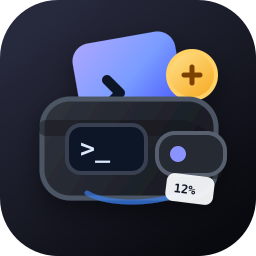

# Toki

<p align="center">
  
</p>

<p align="center">
  <strong>A tiny macOS menu bar companion for AI coding agents and usage.</strong>
</p>

<p align="center">
  
  
  
  
  
  <a href="https://github.com/aashutoshrathi/toki"></a>
</p>

<p align="center">
  <code>/toki</code> keeps your active AI coding accounts, current-session quota, and weekly quota one click away.
</p>

| Menu bar | Widget |
|:---:|:---:|
|  |  |


## Why Toki

Toki is built for people who jump between Claude Code, Codex, Copilot, Gemini, Grok, OpenCode, and Pi during the day and want a fast, local view of usage and active agents.

It works especially well with [`claude-swap`](https://github.com/realiti4/claude-swap): Toki discovers the same Claude Code account registry, shows active and inactive accounts, and lets you switch accounts without reimplementing credential-management logic.

Toki stays local. Credentials are read from your Mac, your configured commands, or provider auth files. The app does not run a cloud service.

## Install

### Homebrew

```sh
brew tap aashutoshrathi/tap
brew trust --cask aashutoshrathi/tap/toki
brew install --cask toki
```

The cask installs the latest release DMG. Toki is ad-hoc signed and not notarized, so macOS quarantines it. Clear the quarantine with:

```sh
xattr -dr com.apple.quarantine /Applications/Toki.app
```

The `-r` (recursive) is important: it also clears the bundled widget extension. Right-clicking Toki and choosing **Open** unblocks the app itself but leaves the nested extension quarantined, so macOS refuses to load it and the widgets stay blank — the recursive `xattr` is what makes the widgets work.

### Direct download

Grab the latest `Toki_<version>_universal.dmg` from the [releases page](https://github.com/aashutoshrathi/toki/releases/latest), open it, and drag Toki to Applications. Updates install in-app once running.


### From source

```sh
swift run Toki                # run in place
scripts/install-app.sh        # build a bundle and install to ~/Applications
```

## What it does

**Quota and spend.** Live rate-limit tracking for Claude Code (multi-account via `claude-swap`, with one-click switching) and Codex, plus local token and spend tracking for OpenCode and Pi. Costs are shown in dollars wherever tokens are.

**Active agents.** Discovery across Codex, Claude Code, Copilot CLI, Gemini CLI, Grok CLI, OpenCode, Pi, and ChatGPT-hosted Codex, with best-effort navigation to the terminal tab or app hosting each one.

**Agents waiting on you.** A session parked on a permission prompt or a question is called out with a red dot and the question itself — on the card, the tab, and the menu bar — so you don't discover it twenty minutes later.

**Daily usage heatmap.** Thirty days, filterable by provider, read from each tool's own session history — so it covers work done before Toki was installed.

**Insights and notifications.** An on-device Apple Intelligence summary on macOS 26+ (deterministic recommendation elsewhere), low-quota and session warnings with cooldowns and DND, and a session mode for tracking burn during a focused run. The insight card can be hidden from Settings.

**Desktop widgets.** Small and medium macOS WidgetKit widgets put account quota, agents awaiting input, and break suggestions on your desktop or in Notification Center — plus a separate quota-rings widget for percentage-based accounts. They refresh from Toki's live data while it runs.

**Quota rings.** Provider-colored rings that show remaining percentage at a glance, in the Accounts panel and as the standalone macOS widget, with provider details on hover. On by default; hide them from the panel or Settings.

**Experimental notch mode.** Off by default, notched Macs only — moves the readout into the display notch, expanding on hover.

## Documentation

| | |
|---|---|
| [Configuration](docs/configuration.md) | Config file, accounts, labels, refresh cadence, state |
| [Providers](docs/providers.md) | Claude Code, Codex, Pi, OpenCode, and the detection-only ones |
| [Features](docs/features.md) | Agents, heatmap, widgets, quota rings, notch mode, insights, notifications, updates |
| [Development](docs/development.md) | Building, concurrency checking, conventions, troubleshooting |
| [Release signing](docs/release-signing.md) | Apple secrets for signing and notarizing release builds |

## Privacy

Toki stays local. Credentials are read from your Mac's Keychain or the provider auth files already on it; there is no cloud service and no telemetry. Session history is read for token counts, costs, timestamps, and titles — never message content. Diagnostics contain error categories and status codes only.

Backwards-compatible fallbacks for the old TokenBar config paths are still honoured.

## License

Toki is free software: you can redistribute it and/or modify it under the terms of the GNU General Public License as published by the Free Software Foundation, either version 3 of the License, or (at your option) any later version.

Toki is distributed in the hope that it will be useful, but WITHOUT ANY WARRANTY; without even the implied warranty of MERCHANTABILITY or FITNESS FOR A PARTICULAR PURPOSE. See the GNU General Public License for more details.

You should have received a copy of the GNU General Public License along with Toki. If not, see <https://www.gnu.org/licenses/>.
